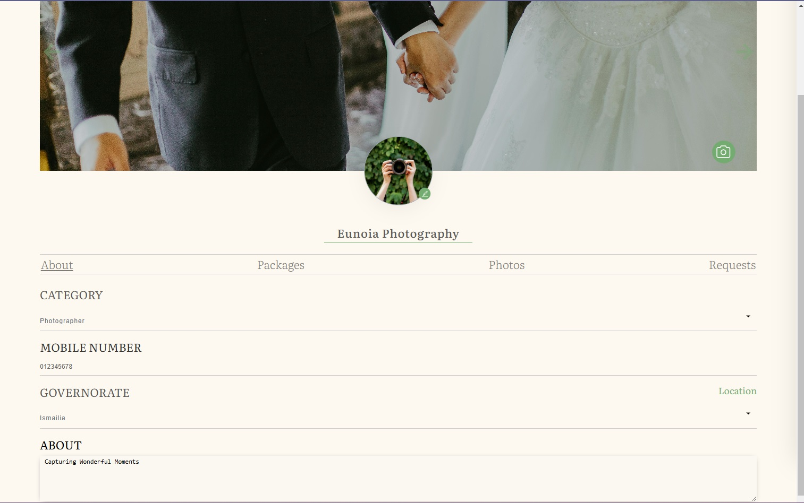

<b>Eunoia</b>

  
 is a comprehensive event planning platform designed to bring all event-related services under one roof. Whether you're planning a wedding, birthday, corporate event, or any special occasion, Eunoia connects you with the right service providers to make your event unforgettable. From venues, photographers, and DJs to event planners and caterers, users can effortlessly discover, compare, and book services tailored to their needs. Service providers, in turn, can showcase their offerings, customize packages, and manage customer interactions—all in one place. 

 

## 💻 Technology Used

- **React.js**: A powerful JavaScript library for building user interfaces.
- **React Query**: Simplifies data fetching and caching.
- **Context API**: Manages global state and simplifies data sharing across components.
- **Styled Components**: Utility-first CSS framework for rapid UI development.
- **Leaflet**: Provides interactive maps for geolocation and location-based services.
- **React Hook Form**: Library for secure and convenient Google OAuth login.
- **React Hot Toast**: Displays elegant and customizable toast notifications.

## Features

**User Authentication:**

- Secure login and sign-up process for both customers and service providers.
- Private routes to ensure secure access to user-specific pages.

**Location-Based Services:**

- Discover nearby service providers using an interactive map powered by Leaflet.

**Favorites:**

- Save preferred services to your favorites for quick access.

**Filtering and Sorting:**

- Filter services by category, price range, ratings, and location.
- Sort results by relevance, popularity, or customer reviews.

**Search:**

- Quickly find specific services or providers using the search feature.

**Booking Requests:**

- Request to reserve specific packages by selecting a date from the calendar.
- Make secure online payments powered by Paymob.

**Customer Reviews:**

- Leave detailed reviews for services used to help others make informed decisions.

**Service Provider Multi-Step Registration:**

- Register with a multi-step form to provide comprehensive service details.

**Service Provider Profiles:**

- Access dual profiles:
  - **Normal Profile**: For personal use.
  - **Business Profile**: Manage services, packages, and customer interactions.

**Business Management Tools:**

- Edit and update business details.
- Add location using an interactive map.
- Upload photos and albums to showcase services.
- Create and customize packages to suit customer needs.
- Manage customer requests with options to accept or decline reservations.

## Screenshots

 
 

 
 

 
 

 
 

 
 

 
 

 
 

 
 

 
 

 
 

 
 

 
